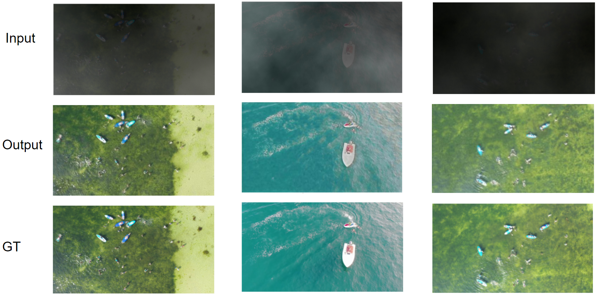

# LVRNet: Lightweight Image Restoration for Aerial Images under Low Visibility


[paper](https://arxiv.org/pdf/2301.05434.pdf) | [dataset](https://github.com/Achleshwar/lvrnet) | [demo](https://github.com/Achleshwar/lvrnet/blob/main/src/lvrnet-notebook.ipynb) | [slides](https://docs.google.com/presentation/d/1jRg8nC07neuUNMKA9Iq62k9DVo-yGxUIzDsVMeecQMc/edit?usp=sharing) | [poster](https://drive.google.com/file/d/1lQUzXrsCRERWxrP9qUomC_-R_rfD92-t/view?usp=sharing) | [code](https://github.com/Achleshwar/lvrnet) | [webpage](https://esha1302.github.io/lvrnet.github.io/)

*AAAI 2023 Student Abstract and Poster Program Submission*


LVRNet, short for Low-Visibility Restoration Network, is a method that can effectively recover 
high-quality images from degraded images taken in poor visual conditions. Although we have tested 
our work for two degrading factors combined: low-light and haze, you can use this codebase
and run experiments for other degrading factors as well using the instructions given below.


## Method Overview


## Quick Start

### 1. Install Environment

```shell
git clone https://github.com/Achleshwar/lvrnet.git
cd lvrnet 
pip install -r requirements.txt
```

### 2. Download Dataset
We have used public [dataset AFO](https://www.kaggle.com/datasets/jangsienicajzkowy/afo-aerial-dataset-of-floating-objects) and generated our dataset - `Low-Vis AFO`, by adding
low visibility conditions. You can download it [here]().


### 3. Demo using pretrained Weights
For a quick demo, you can use our pretrained weights and run them on a demo images using `src/lvrnet-notebook.ipynb`.

Download the pretrained weights from [here](https://drive.google.com/file/d/1TxelsYpuSfNcGphlaal1r2EfL64uALBE/view?usp=sharing) and change `model_wts` path in the notebook.
  
### 4. Reproducing the results
```shell
## train from scratch
python train.py --epochs 50 --data_dir <path to dataset> --log_dir <path to save weights> --perloss --edgeloss --fftloss
```




## Citation
If you find this work useful, please cite our paper:
```
@misc{pahwa2023lvrnet,
      title={LVRNet: Lightweight Image Restoration for Aerial Images under Low Visibility}, 
      author={Esha Pahwa and Achleshwar Luthra and Pratik Narang},
      year={2023},
      eprint={2301.05434},
      archivePrefix={arXiv},
      primaryClass={cs.CV}
}
```
## Acknowledgement
We would like to thank the authors of [FFANet](https://github.com/zhilin007/FFA-Net/tree/master), [NAFNet](https://github.com/megvii-research/NAFNet) and [MC-Blur](https://github.com/HDCVLab/MC-Blur-Dataset) for their codebase. We have used their codebase as a starting point for our work.


## TODOs
- [ ] Add results on OOD images
- [ ] Add link to dataset
- [ ] Add link to project page
